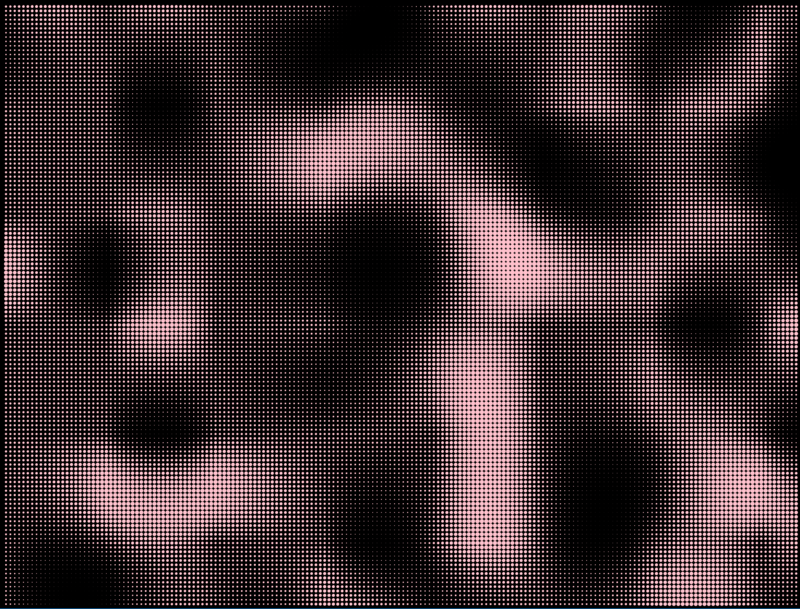

```kotlin
fun main() {
    application {
        configure {
            width = 1440
            height = 1080
            windowResizable = true
        }
        program {
            extend {
                drawer.fill = ColorRGBa.PINK
                drawer.stroke = null
                val scale = 0.005
                for (y in 16 until height step 8) {
                    for (x in 16 until width step 8) {
                        val radius = perlinLinear(100, x * scale, y * scale) * 4.0 + 4.0
                        drawer.circle(x * 1.0, y * 1.0, radius)
                    }
                }
            }
        }
    }
}
```


